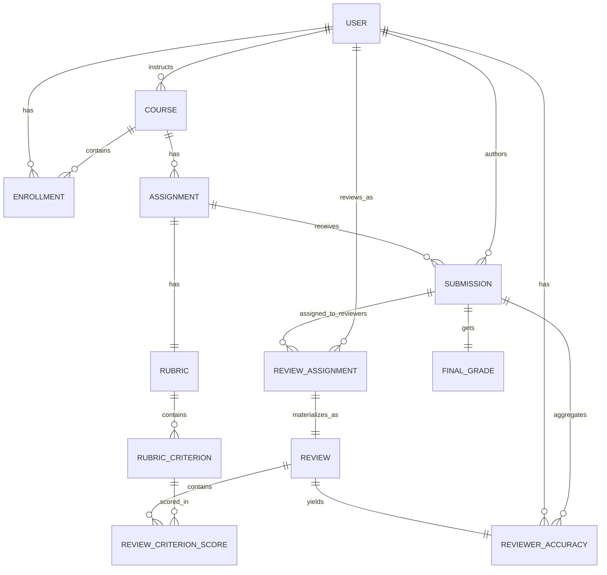
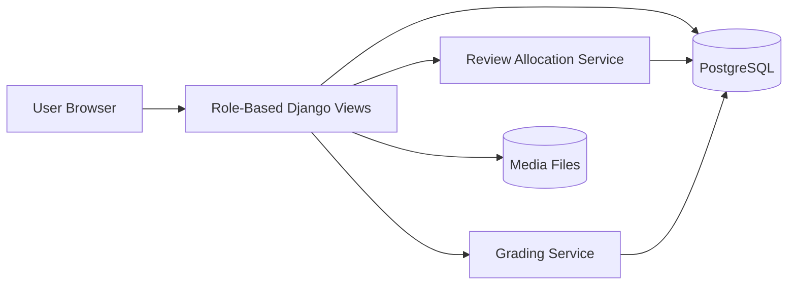

# Academic Peer Review System

This document is presentation-ready and can be used as your architecture + ER source for slides.

## 1) Project in one line

A modular Django system that runs the full academic peer-review lifecycle:

Course setup -> enrollment -> assignment -> submission -> anonymous peer review -> grade computation -> result release.

## 2) Tech architecture

- Backend: Django 5 (class-based views + modular apps)
- Database: PostgreSQL
- Frontend: Django templates + Bootstrap 5 + Bootstrap Icons
- Auth: Custom user model (`accounts.User`) with role-based access
- File storage: local media (`Submission.file`)
- Core pattern: thin views + service-layer business logic (`reviews/services.py`, `grading/services.py`)

## 3) App-level architecture (module responsibilities)

- `accounts`: user model, role routing, auth, dashboards
- `courses`: course management and student enrollment
- `assignments`: assignment management per course
- `submissions`: student submission artifacts (single submission per student/assignment)
- `rubrics`: rubric + criterion definitions for scoring
- `reviews`: anonymous reviewer allocation and review capture
- `grading`: final score, letter grade, GPA, release workflow, reviewer accuracy

## 4) High-level request flow

1. User signs in and is routed by role (`ADMIN`, `INSTRUCTOR`, `STUDENT`).
2. Instructor creates course and assignment.
3. Students are enrolled into course.
4. Students submit assignment (`Submission`).
5. Instructor defines rubric and criteria.
6. Instructor runs reviewer allocation (default 3 reviewers/submission).
7. Students complete assigned anonymous reviews.
8. Instructor calculates final grades from completed reviews.
9. Instructor releases grades.
10. Student sees released grade and anonymized feedback.

## 5) Detailed business flow

### A. Setup and access control

- `accounts.User` extends `AbstractUser` with `role` and `reg_no`.
- `RoleRequiredMixin` guards non-public views.
- Ownership constraints:
  - instructors only manage their own course graph
  - students only access enrolled-course data

### B. Submission lifecycle

- One submission per (`assignment`, `student`) via uniqueness constraint.
- `status`: `SUBMITTED` or `LATE`.
- File path is organized by assignment and student registration number.

### C. Anonymous peer review lifecycle

- `allocate_reviewers(assignment)` creates `ReviewAssignment`.
- `ReviewAssignment` enforces:
  - no self-review (`clean()`)
  - unique reviewer per submission
  - anonymous URL token (`anonymous_token`) for student-facing review links
- Reviewer submits one `Review` per `ReviewAssignment`.
- Per-criterion scoring is stored in `ReviewCriterionScore`.

### D. Grade computation lifecycle

- `calculate_grades_for_assignment(assignment, force=False)`:
  - validates rubric exists and has positive total marks
  - requires at least configured review count per submission
  - normalizes each review score to 0-100
  - computes final score as mean of normalized scores
  - maps score to letter/GPA
  - writes `FinalGrade`
  - computes `ReviewerAccuracy`
- `release_grades(assignment)` sets grades visible to students.
- `unrelease_grades(assignment)` reverts to hidden calculated state.

## 6) ER model overview

Use this section directly in ER slides.

### Core entities

- `User` (roles: admin/instructor/student)
- `Course`
- `Enrollment`
- `Assignment`
- `Submission`
- `Rubric`
- `RubricCriterion`
- `ReviewAssignment`
- `Review`
- `ReviewCriterionScore`
- `FinalGrade`
- `ReviewerAccuracy`

### Key relationship map (cardinality)

- `User (instructor)` 1 -> N `Course`
- `Course` 1 -> N `Assignment`
- `Course` 1 -> N `Enrollment`
- `User (student)` 1 -> N `Enrollment`
- `Assignment` 1 -> N `Submission`
- `User (student)` 1 -> N `Submission`
- `Assignment` 1 -> 1 `Rubric`
- `Rubric` 1 -> N `RubricCriterion`
- `Submission` 1 -> N `ReviewAssignment`
- `User (student reviewer)` 1 -> N `ReviewAssignment`
- `ReviewAssignment` 1 -> 1 `Review`
- `Review` 1 -> N `ReviewCriterionScore`
- `RubricCriterion` 1 -> N `ReviewCriterionScore`
- `Submission` 1 -> 1 `FinalGrade`
- `Review` 1 -> 1 `ReviewerAccuracy`
- `Submission` 1 -> N `ReviewerAccuracy`
- `User (reviewer)` 1 -> N `ReviewerAccuracy`

### Constraint highlights (important for viva/presentation)

- Unique enrollment: (`course`, `student`)
- Unique submission: (`assignment`, `student`)
- One rubric per assignment: `Rubric.assignment` is one-to-one
- Unique reviewer assignment: (`submission`, `reviewer`)
- No self-review: reviewer cannot equal submission author
- Unique criterion score per review: (`review`, `criterion`)
- Grade lifecycle states: `CALCULATED` -> `RELEASED`

## 7) ER diagram (Mermaid)

## 8) Architecture diagram (slide-friendly)

## 9) Suggested presentation sequence (8-10 slides)

1. Problem and objective
2. Tech stack and why modular Django
3. App map and responsibility split
4. End-to-end workflow
5. Anonymous review design
6. Grade calculation logic
7. ER model and cardinalities
8. Constraints and data integrity
9. Demo screenshots (dashboards/workflows)
10. Future improvements (notifications, analytics, rubric templates, anti-collusion checks)

## 10) What to share with AI for slide generation

Share this file instead of `AGENTS.md` when the goal is presentation generation.  
`AGENTS.md` is excellent as internal engineering context, but this document is cleaner for architecture-focused output.
